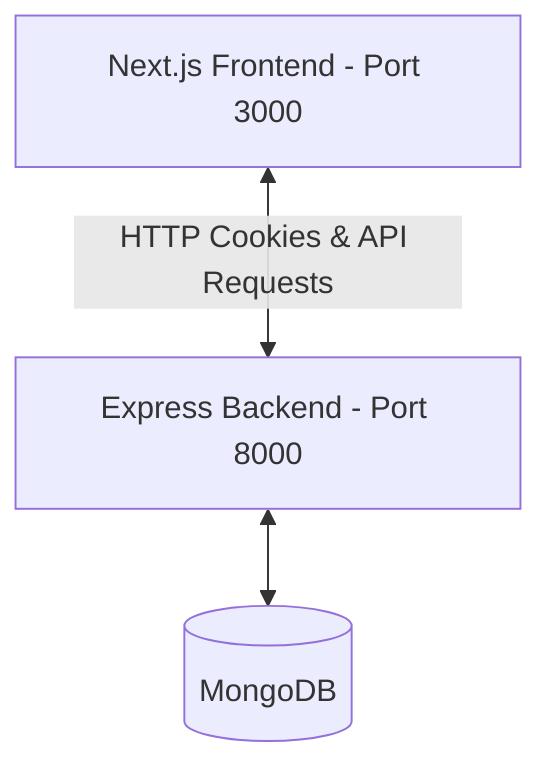

# Lead Management CRM

An authenticated, multi-tenant Lead Management CRM platform designed to capture, assign, and track leads through a complete lifecycle pipeline. Built with a decoupled architecture utilizing an Express/Mongoose backend and a Next.js (App Router)/Redux frontend.

---

## Project Architecture & Tech Stack

This project follows a decoupled client-server architecture with strict separation of concerns, built with TypeScript end-to-end.



### Backend
- **Core**: Node.js, Express, TypeScript, Mongoose
- **Database**: MongoDB (Mongoose schemas with virtuals and indexes)
- **Authentication**: JWT-based session management. Access tokens are passed via secure HTTP-Only cookies (`accessToken`, `refreshToken`) or fallback `Authorization` Bearer headers.
- **Middlewares**: Enforces Route Protection and Role-Based Access Control (RBAC).

### Frontend
- **Core**: Next.js 16 (App Router), TypeScript, TailwindCSS
- **State Management**: Redux Toolkit (with typed hooks `useAppDispatch` and `useAppSelector`)
- **API Client**: Axios instance configured with `withCredentials: true` to support cookie-based sessions, forwarding requests through Next.js rewrites.

---

## Project Structure

```
lead-management-crm/
├── backend/                  # Express API Server (Node + TypeScript)
│   ├── src/
│   │   ├── controllers/      # Route controllers (Auth, Leads, Notes, Users, etc.)
│   │   ├── middlewares/      # Authentication & Authorization middlewares
│   │   ├── models/           # Mongoose Database Models
│   │   ├── routes/           # Express API Route declarations
│   │   ├── tests/            # Vitest integration tests (with mongodb-memory-server)
│   │   └── utils/            # Shared utilities (ApiError, ApiResponse, logging)
│   └── tsconfig.json
│
├── frontend/                 # Next.js App (Next.js 16 + TypeScript + Tailwind)
│   ├── app/                  # Next.js App Router pages & layouts
│   │   ├── dashboard/        # Authenticated dashboard views (Leads, Users)
│   │   └── public/           # Publicly shareable lead capture form pages
│   ├── components/           # UI and Page layout components (shadcn/ui + custom)
│   ├── hooks/                # Reusable React hooks
│   └── lib/                  # State management & network clients
│       ├── api/              # Axios API request clients
│       └── store/            # Redux Toolkit store, slices, and selectors
│
└── documentations/           # Domain models, specs, and roadmaps
    ├── db-design.md          # ERD diagram (mermaid) and schema documentation
    ├── api-documentation.md  # Detailed endpoint declarations
    └── roadmap.md            # Score-based project roadmap
```

---

## Database Schema

The platform tracks entities across 5 primary MongoDB collections using Mongoose models:

### 1. Organization
Represents the tenant container. All Users and Leads belong to an Organization.
- `name` (String, required)
- `slug` (String, required, unique) - Used for public routing/tenant matching

### 2. User
CRM operators within an organization.
- `name` (String, required)
- `email` (String, required, unique)
- `password` (String, required, select: false)
- `role` (String, enum: `["admin", "member"]`, default: `"member"`)
- `organization` (ObjectId -> Organization, required)
- `isActive` (Boolean, default: `true`)

### 3. Lead
Sales prospects tracked inside the lifecycle funnel.
- `firstName` (String, required)
- `lastName` (String)
- `email` (String)
- `phone` (String)
- `company` (String)
- `source` (String)
- `status` (String, enum: `["new", "contacted", "qualified", "proposal_sent", "negotiation", "won", "lost"]`, default: `"new"`)
- `priority` (String, enum: `["low", "medium", "high"]`, default: `"medium"`)
- `description` (String)
- `organization` (ObjectId -> Organization, required)
- `assignedTo` (ObjectId -> User, nullable)
- `createdBy` (ObjectId -> User, nullable)

### 4. Note
Timeline comments and records authored by users on leads.
- `lead` (ObjectId -> Lead, required)
- `author` (ObjectId -> User, required)
- `content` (String, required)

### 5. Activity
An immutable, automatically appended audit trail tracking actions on leads.
- `lead` (ObjectId -> Lead, required)
- `actor` (ObjectId -> User, nullable)
- `action` (String, enum: `["LEAD_CREATED", "STATUS_CHANGED", "LEAD_ASSIGNED", "NOTE_ADDED", "LEAD_DELETED"]`)
- `metadata` (Schema.Types.Mixed) - Stores state changes (e.g., `{ oldStatus, newStatus }`)

---

## Permission Matrix & RBAC

Role-Based Access Control (RBAC) is enforced strictly on the backend and dynamically checked on the frontend.

| Action / Resource | Admin | Member | Public / Anonymous |
| :--- | :---: | :---: | :---: |
| Register Tenant Organization | ✅ | ❌ | ✅ |
| Authenticate / Login | ✅ | ✅ | ✅ |
| View Assigned Leads | ✅ | ✅ | ❌ |
| View All Organization Leads | ✅ | ❌ | ❌ |
| Create Lead (Internal Dashboard) | ✅ | ✅ | ❌ |
| Submit Lead via Public Capture Form | ❌ | ❌ | ✅ (Public endpoint matched by `orgSlug`) |
| Update Lead Lifecycle Status | ✅ | ✅ (Only assigned leads) | ❌ |
| Reassign Lead Owner | ✅ | ❌ | ❌ |
| Delete Lead | ✅ | ❌ | ❌ |
| Add / View Lead Notes | ✅ | ✅ (Only assigned leads) | ❌ |
| Manage Organization Members | ✅ | ❌ | ❌ |
| Delete Tenant Organization | ✅ | ❌ | ❌ |

---

## Environment Variables

### Backend Configuration
Create a `.env` file in the `backend/` directory:
```env
PORT=8000
MONGODB_URI="mongodb://localhost:27017/lead-crm"
ACCESS_TOKEN_SECRET="your-super-secret-access-key-here"
ACCESS_TOKEN_EXPIRY="1d"
REFRESH_TOKEN_SECRET="your-super-secret-refresh-key-here"
REFRESH_TOKEN_EXPIRY="15d"
```

### Frontend Configuration
Create a `.env` file in the `frontend/` directory:
```env
# URL of backend server
API_BASE_URL=http://localhost:8000/api/v1
# Proxied Next.js base path (for Client Components)
NEXT_PUBLIC_API_BASE_URL=http://localhost:3000/api
```

---

## Installation & Local Setup

Ensure you have [Node.js (v18+)](https://nodejs.org/) and a running [MongoDB instance](https://www.mongodb.com/) installed.

### 1. Clone the repository
```bash
git clone https://github.com/your-username/lead-management-crm.git
cd lead-management-crm
```

### 2. Setup the Backend
```bash
cd backend
npm install
# Copy environment template
cp .env.sample .env # Update MONGODB_URI & Secrets
# Start development server
npm run dev
```

The backend server runs at `http://localhost:8000`.

### 3. Setup the Frontend
```bash
cd ../frontend
npm install
# Copy/create environment file
echo "API_BASE_URL=http://localhost:8000/api/v1\nNEXT_PUBLIC_API_BASE_URL=http://localhost:3000/api" > .env
# Start dev server
npm run dev
```

Open `http://localhost:3000` in your browser.

---

## Running Tests

Integration and unit tests are configured in the backend package using [Vitest](https://vitest.dev/) and an in-memory MongoDB server (`mongodb-memory-server`) to ensure database isolation.

Navigate to the `backend/` directory to run test commands:

```bash
cd backend

# Run all tests once
npm run test

# Run tests in watch mode (interactive)
npm run test:watch

# Run tests with code coverage reporting
npm run test:coverage

# Run TypeScript compilation check
npm run check
```

---

## API Endpoint Summary

Below is a quick reference of the API endpoints. For detailed body schemas and response structures, see the [Full API Documentation](file:///home/bhargab/WebD/lead-management-crm/documentations/api-documentation.md).

### Authentication (`/api/v1/auth`)
- `POST /auth/register` - Create a new Tenant Organization and Admin account.
- `POST /auth/login` - Authenticate user, returns Access Token cookie.
- `POST /auth/logout` - Clear authentication cookies.
- `GET /auth/me` - Fetch authenticated user details.

### Leads (`/api/v1/leads`)
- `GET /leads` - List leads (paginated; restricted to assigned leads for standard Members).
- `POST /leads` - Create a new lead internally.
- `POST /leads/public/:orgSlug` - Submit a lead from the public tenant landing page.
- `GET /leads/:id` - Fetch individual lead details.
- `PATCH /leads/:id` - Update lead status or details.
- `DELETE /leads/:id` - Delete lead and associated notes/activities.
- `PATCH /leads/:id/assign` - Assign a lead to a specific user (Admin-only).

### Notes (`/api/v1/leads/:id/notes` & `/api/v1/notes`)
- `POST /leads/:id/notes` - Add a note to a lead.
- `GET /leads/:id/notes` - List notes for a specific lead.
- `PATCH /notes/:id` - Edit note content (author-only).
- `DELETE /notes/:id` - Delete a note (author or Admin).

### Organization & Users (`/api/v1/organizations` & `/api/v1/users`)
- `GET /organizations` - Fetch active organization details.
- `PATCH /organizations` - Update organization details (Admin-only).
- `POST /users` - Add a member to the organization (Admin-only).
- `GET /users` - List all members of the organization (Admin-only).
- `PATCH /users/:id` - Update member details/role (Admin-only).
- `DELETE /users/:id` - Remove a member (Admin-only).

---

## Deployment Guidelines

### 1. Build and Production Run
Always validate types before building.

**Backend Build & Run:**
```bash
cd backend
npm run check  # Type check
npm run build  # Compiles to dist/
npm start      # Launches server via node dist/index.js
```

**Frontend Build & Run:**
```bash
cd frontend
npm run typecheck # Type check
npm run build     # Optimizes Next.js bundle for production
npm start         # Starts production Next.js node server
```

### 2. Environment Considerations
- Ensure JWT secrets (`ACCESS_TOKEN_SECRET`, `REFRESH_TOKEN_SECRET`) are kept secure and distinct in production.
- Make sure `withCredentials: true` is configured and CORS origins match the domain hosting your Next.js application.
- Secure HTTP-Only cookies should have the `secure: true` flag enabled in production.
