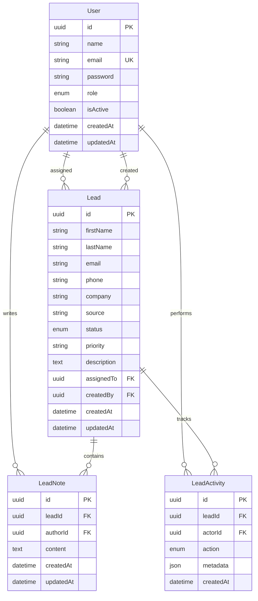

```mermaid
erDiagram

    User {
        uuid id PK
        string name
        string email UK
        string password
        enum role
        boolean isActive
        datetime createdAt
        datetime updatedAt
    }

    Lead {
        uuid id PK
        string firstName
        string lastName
        string email
        string phone
        string company
        string source
        enum status
        string priority
        text description
        uuid assignedTo FK
        uuid createdBy FK
        datetime createdAt
        datetime updatedAt
    }

    LeadNote {
        uuid id PK
        uuid leadId FK
        uuid authorId FK
        text content
        datetime createdAt
        datetime updatedAt
    }

    LeadActivity {
        uuid id PK
        uuid leadId FK
        uuid actorId FK
        enum action
        json metadata
        datetime createdAt
    }

    User ||--o{ Lead : "assigned"
    User ||--o{ Lead : "created"
    User ||--o{ LeadNote : "writes"
    User ||--o{ LeadActivity : "performs"

    Lead ||--o{ LeadNote : "contains"
    Lead ||--o{ LeadActivity : "tracks"
```
